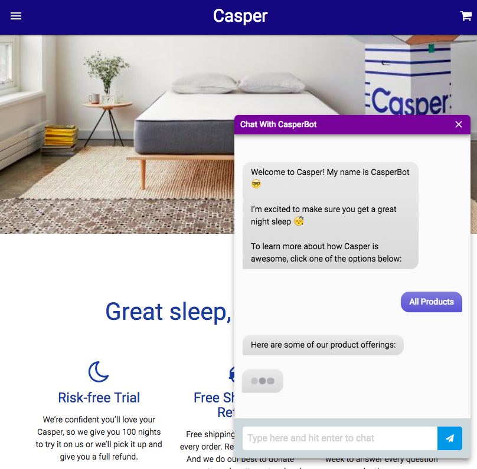
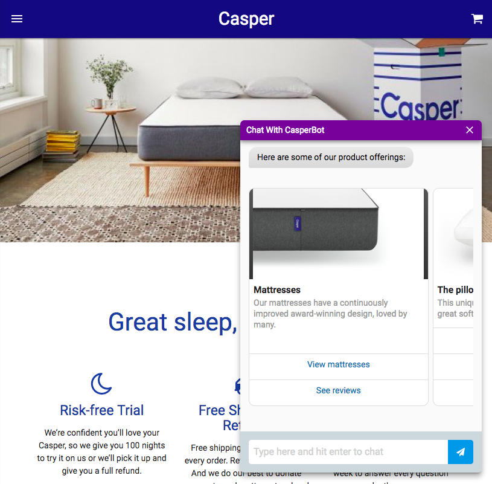

# Casper - Front End

> Casper is a mattress manufacturer. This project is an attempt to showcase how they could benefit from a chatbot.

You can view a live sample of this app at https://casperchatbotexample.herokuapp.com. 

**NOTE:** The web app and the chat interface may freeze for the first 30 seconds as the front end and back end Heroku dynos "wake up".

## Table of contents

- [Getting started](#getting-started)
    - [System requirements](#system-requirements)
    - [Installation](#installation)
    - [Running tests](#running-tests)
    - [Additional resources](#additional-resources)
- [The Project](#the-project)
    - [Proposal](#proposal)
    - [Target audience](#target-audience)
    - [Goals](#goals)
    - [Requirements](#requirements)
    - [Design considerations](#design-considerations)
- [Contributions](#contributions)
    - [Style guides](#style-guides)

## Getting started

### System requirements

- [npm](https://www.npmjs.com/) 5.4.0
- Unix like operating system (OS X, Ubuntu, Debian, etc.)
- Not yet tested on Windows

### Installation

**Note:** The back end API was created using Node.js and will remain in a private repository for the moment. The back end was mainly designed based on Facebook's Messenger API to make it compatible with Facebook Messenger. Feel free to design your own API and run it with code from this repository.

1. Install [npm](https://www.npmjs.com/)
1. Clone or download this repository
1. `cd` into project directory *(If not already there)*
1. In the terminal run `cp .env.sample .env` and update the environment variables as needed.
1. Startup the API server at *http://localhost:3000* or whichever server you specify in the `.env` file
1. In the terminal run `npm install` then run `npm start`
1. View in browser at *http://localhost:3001 (or other port number)*

### Running tests

There are currently no tests, but they will be added in the near future once I learn the Jest testing framework and Enzyme as demonstrated in [this React Udemy course](https://www.udemy.com/react-2nd-edition/)

### Additional resources

- [List of Google Material Icons](https://material.io/icons/)
- [List of Font Awesome Icons](http://fontawesome.io/icons/)

## The Project

### Proposal

I propose that I create a fully featured chatbot interface for Casper's website. This app is a demonstration of what that experience would be like for the end user.

### Target audience

This app is for the Casper Sleep marketing and engineering team.

### Goals

- Show Casper Sleep Inc. the benefits of having a robust chatbot interface

### Requirements

- A chat interface with a chatbot that can answer any question that is referenced in [Casper's FAQ](https://casper.com/ca/en/faqs)

### Design considerations

- I chose to use [Materialize CSS](http://materializecss.com/) because I really appreciate their design decisions. I have also read through most of [Google's Material Design Guidelines](https://material.io/guidelines/) and I agree with a lot of their opinions on User Experience.

## Contributions

I'm not accepting contributions at this time but you can email me if you have any suggestions. greganswer@gmail.com

### Style guides

- [UI Namespaces](https://csswizardry.com/2015/03/more-transparent-ui-code-with-namespaces/#javascript-namespaces-js-)
    - JavaScript classes: `jsButtonCollapse` (*'js'*, followed by *'noun/namespace'* followed by *'verb'*, in *camel case*)

## Legal

All branding and imagery is wholly owned by  Casper Sleep, Inc.
